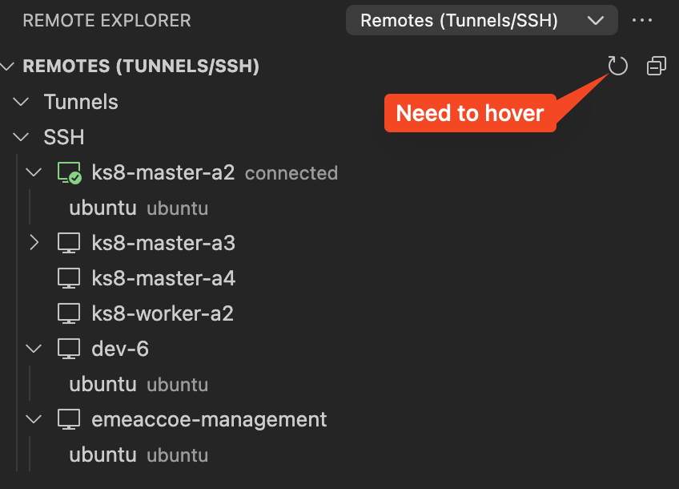

# Tenancy Setup on OCI

1. Create a compartment in your name, or just name this k8s. You will be using this compartment throughout the workshop
2. Create a VCN, via wizard, with default settings. You can name it `k8s`
3. If you do not have a SSH key file, create it. You will be using it to connect the instances
4. Create instance:
    1. Go to your compartment
    2. Create instance with the following selection:
        - **Name:** `k8s-master`
        - **Shape (default):** E4.flex, 1 OCPU, 16 GB RAM
        - **Image:** Ubuntu, 22.04
        - **Network (default):** VCN, public subnet
        - **Key:** your key file to be uploaded

- Throughout the remainder of the workshop, you can use the configuration above while creating instances, unless specified otherwise
- The first instance will be the master node. The worker node(s) to be created later. We will be taking a snapshot (compute image) of some runtime and configuration. Worker nodes are created from that image. That will speed-up the process
- VScode will be used to connect the instances remotely. Recommended config & usage:
    - Extensions:
        - [Remote Development](https://marketplace.visualstudio.com/items?itemName=ms-vscode-remote.vscode-remote-extensionpack)
        - [Save as Root in Remote - SSH](https://marketplace.visualstudio.com/items?itemName=yy0931.save-as-root)
        - [Window Colors](https://marketplace.visualstudio.com/items?itemName=stuart.unique-window-colors) *optional*
        - [Resource Monitor](https://marketplace.visualstudio.com/items?itemName=mutantdino.resourcemonitor) *optional*
    - Remote connections
        - While adding a new configuration (for the fist time), use the following ssh command: `ssh ubuntu@<ip>`, where the *ip* is the Public IP address of the compute instance
        - Later edit the SSH configuration file (the one located under your user folder)  
        - Rename the friendly name, same as your instance name 
        - After creating new instance, you can copy-paste the necessery lines, just replace the host value and the ip value from the new instance. Make sure that the indentations are correct. Eventually save the file. To list new changes, you need to press refresh 
        - While connecting for the fist time you will be asked to confirm the remote key signature 
    - Remote installed extensions:
        - Some of the VScode extensions require to be manually installed on the remote environment. From the extensions above, **Save as Root in Remote - SSH**, **Window Colors** and **Resource Monitor** require such touch. 
    - Open remote (workspace) folder:
        - Open the folder from explorer   
    - Change colors *optional*:
        - We will be connecting multiple instances at the same time. It is easy to confuse similar looking windows with each other. To distinguish them, with the help of **Window Colors** extension, we will adjust colors of the windows per workspace (instance)
        - 
            1. Open the terminal
            2. Write the following command: `code .vscode/settings.json`. This will start editing the hidden settings file
            3. To change the colors, hover to the shown color in the editor. Color changer will pop up. Select the desired colors
            4. **Save!** Changes are applied after file is saved

    