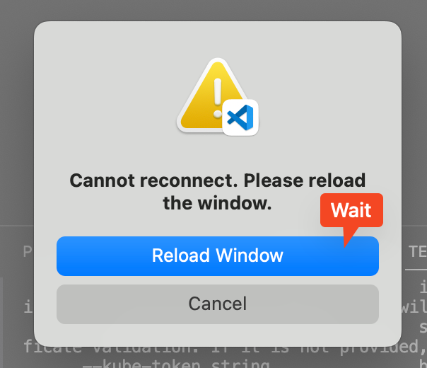

# Kubernetes Installation
This will install the required packages, just before initializing the cluster.

## Basics
1. OS Configurations
2. Install the Container Runtime - Docker
3. K8s installation
4. Install helm
5. Create image

You are given script files to automate the installation. This will greately speed up the process. They are kept up-to-date as needed. Make sure that they are not outdated.

> Make sure all steps are completed in order

## 1. OS Configurations
We have selected Ubuntu 22.04 as the OS. Through rest of the workshop, commands are tailored for the specific OS.

1. Disable swap
    ```shell
    sudo swapoff -a
    ```
2. Disable firewall  
    ```shell
    sudo systemctl stop ufw
    sudo systemctl disable ufw
    ```
    > Normally you do not disable the firewall, instead configure it for [the ports](https://kubernetes.io/docs/reference/networking/ports-and-protocols/). We are skipping this, just disabling for the workshop. There is nothing much sensitive running here.
3. Install net tools
    ```shell
    sudo apt install net-tools -y
    ```

## 2. Container Runtime
There are multiple [container runtimes](https://kubernetes.io/docs/setup/production-environment/container-runtimes/) are supported by Kubernetes. For this workshop we will be using docker.

### 2.1 Docker installation

You can follow the official guide or use the [script](../scripts/docker-install.sh)

#### Official docs
1. Follow the official [Install Docker Engine on Ubuntu guide](https://docs.docker.com/engine/install/ubuntu/)
2. Make sure that [Linux postinstall](https://docs.docker.com/engine/install/linux-postinstall/) are not missed

#### Scripted install
```shell
curl https://raw.githubusercontent.com/alperozisik/k8s-basic-workshop/main/scripts/docker-install.sh | bash
newgrp docker
```

### 2.2 Install cri-dockerd
This enables docker & kubernetes to talk to each other. In earlier versions of Docker this was included in the bundle.

Review the [script file](../scripts/cri-dockerd-install.sh) and execute it. (Release might be updated in future)

**Install**
```shell
curl https://raw.githubusercontent.com/alperozisik/k8s-basic-workshop/main/scripts/cri-dockerd-install.sh | bash
```

## 3. K8s installation
We are going to install necessary tools to initialize a k8s cluster.

You will install these packages on all of your machine:
- **kubeadm:** the command to bootstrap the cluster.
- **kubelet:** the component that runs on all of the machines in your cluster and does things like starting pods and containers.
- **kubectl:** the command line util to talk to your cluster

You can check the official documentation: [Installing kubeadm](https://kubernetes.io/docs/setup/production-environment/tools/kubeadm/install-kubeadm/#installing-runtime), which will install all of them.

> This environment that is provided by OCI & Ubuntu. It is quite updated. Most of the prerequisites in the documentation is already met.

Please review the [install script](../scripts/kubeadm-install.sh) and perform installation as following:
```shell
curl https://raw.githubusercontent.com/alperozisik/k8s-basic-workshop/main/scripts/kubeadm-install.sh | bash
```

## 4. Install helm
Helm is a package manager for k8s. In the next step, we will be creating an image. It is good to include it in the image.
It can be installed easly as stated in [the official documentation](https://helm.sh/docs/intro/install/#from-apt-debianubuntu)
```shell
curl https://raw.githubusercontent.com/alperozisik/k8s-basic-workshop/main/scripts/helm-install.sh | bash
```

## 5. Create Image
1. If you are not familiar with creating images, review the [Creating a Custom Image document](https://docs.oracle.com/en-us/iaas/secure-desktops/create-custom-image.htm)
2. Create image in same compartment, name it as `k8s-base`. While creating the image, machine will be offline, automatically restart afterwards. Do not refresh VScode window, until instance status becomes ready. 