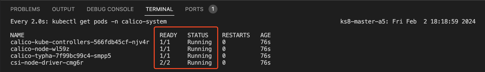

# Creating cluster

## Initialize cluster
We are going to create a single master node K8s cluster. Execute the following script to init the cluster via kubeadm:
```shell
sudo kubeadm init --pod-network-cidr 192.168.0.0/16 --service-cidr 10.96.0.0/16 --apiserver-advertise-address $(ifconfig ens3 | grep "inet " | awk '{print $2}') --cri-socket unix:///var/run/cri-dockerd.sock
```
Let's break down some of the arguments:
- `--pod-network-cidr` network of the pods. This is optional and the value provided by our picking
- `--service-cidr` network of the k8s internal services. This is optional and the value provided by our picking
- `--apiserver-advertise-address` Private IP address of the master node. This IP should  be accessible by other nodes in the same cluster. This is required. `$(ifconfig ens3 | grep "inet " | awk '{print $2}')` automatically getting the IP address from the network interface.
- `--cri-socket` which container runtime that we are going to use. Documentation says optional. By experince, it is best to be provided.

For more information please check official documentation: [Creating a cluster with kubeadm](https://kubernetes.io/docs/setup/production-environment/tools/kubeadm/create-cluster-kubeadm/)

## Post init
When *kubeadm* finishes, you will get an output that looks like this:
```
Your Kubernetes control-plane has initialized successfully!

To start using your cluster, you need to run the following as a regular user:

  mkdir -p $HOME/.kube
  sudo cp -i /etc/kubernetes/admin.conf $HOME/.kube/config
  sudo chown $(id -u):$(id -g) $HOME/.kube/config

Alternatively, if you are the root user, you can run:

  export KUBECONFIG=/etc/kubernetes/admin.conf

You should now deploy a pod network to the cluster.
Run "kubectl apply -f [podnetwork].yaml" with one of the options listed at:
  https://kubernetes.io/docs/concepts/cluster-administration/addons/

Then you can join any number of worker nodes by running the following on each as root:

kubeadm join 10.6.0.56:6443 --token inx5ge.z8lgw44zr3ui9r4t \
        --discovery-token-ca-cert-hash sha256:a8958c7cfa5e57db14e299c98cd466aa6f54821a1a6676d802f474f5e20a0626 
```

It is essential to perform:
```shell
mkdir -p $HOME/.kube
sudo cp -i /etc/kubernetes/admin.conf $HOME/.kube/config
sudo chown $(id -u):$(id -g) $HOME/.kube/config
```

Note the last command from the tool. This `kubeadm join ...` command generated by the kubeadm, will be used **on the worker nodes** to have them joining to the cluster. The token provided there is time-bound; it will expire in 23H. When it is expired, you can generate new one. This will not revoke the previous token/command.
```shell
sudo kubeadm token create --print-join-command
```
You can use the same join command on multiple worker nodes. No need to use separate for each.

> Do not execute join command on the master node.

## Install network plugin
Networking of pods, nodes are not part of the k8s. It is handled by the network plugin. Here are some popular network plugins. You can use **flannel** or **calico** as desired
- **calico:** This is very popular
- **flannel:** This is favored by Oracle Cloud
- Official documentation
    - [Network Plugins](https://kubernetes.io/docs/concepts/extend-kubernetes/compute-storage-net/network-plugins/)
    - [Container Network Interface (CNI) - networking for Linux containers](https://github.com/containernetworking/cni)

### Install Calico
> DO NOT install, if you are going to use **flannel**

Please review steps in [official documentation](https://docs.tigera.io/calico/latest/getting-started/kubernetes/quickstart#install-calico)

Execute the following to install:
```shell
kubectl create -f https://raw.githubusercontent.com/projectcalico/calico/v3.27.0/manifests/tigera-operator.yaml
kubectl create -f https://raw.githubusercontent.com/projectcalico/calico/v3.27.0/manifests/custom-resources.yaml
```
This will going to install some kubernetes compontents. This will take some time. Check the installation as below:
```shell
watch kubectl get pods -n calico-system
```
You **MUST** see all numbers **full** and **Running** 

To exit *watch* press `CTRL + C`. After that you can continue installation

### Install flannel
> DO NOT install if you are going to use **calico**
```shell
kubectl create ns kube-flannel
kubectl label --overwrite ns kube-flannel pod-security.kubernetes.io/enforce=privileged

helm repo add flannel https://flannel-io.github.io/flannel/
helm install flannel --set podCidr="192.168.0.0/16" --namespace kube-flannel flannel/flannel
```