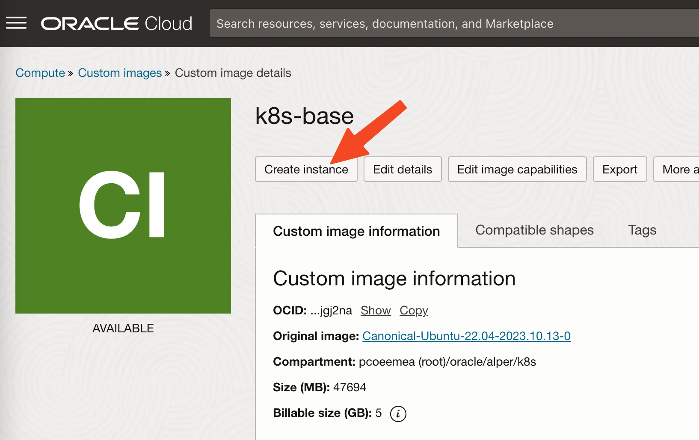
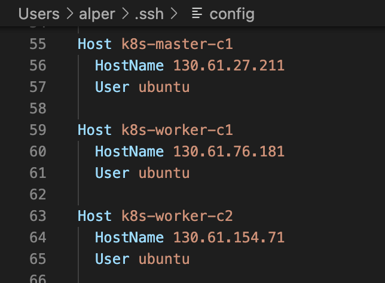
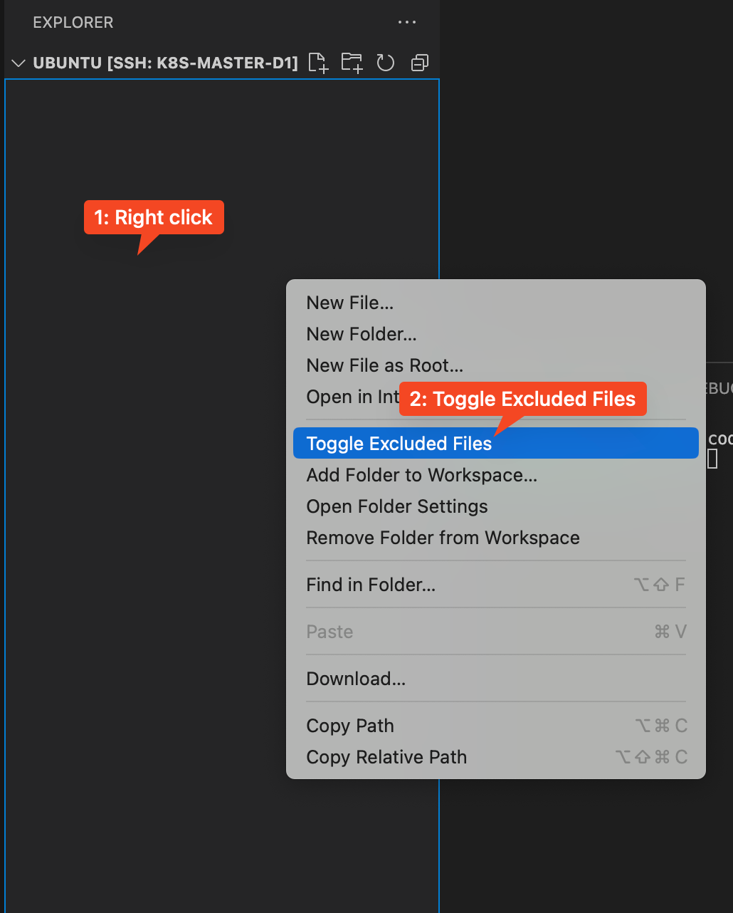
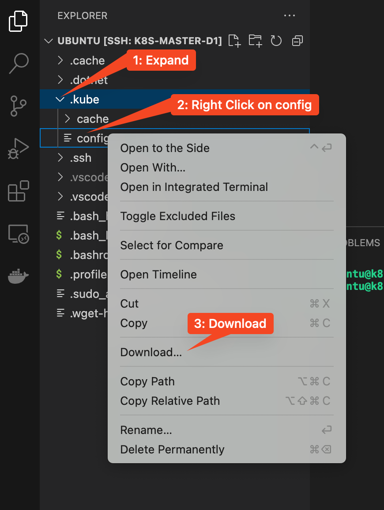
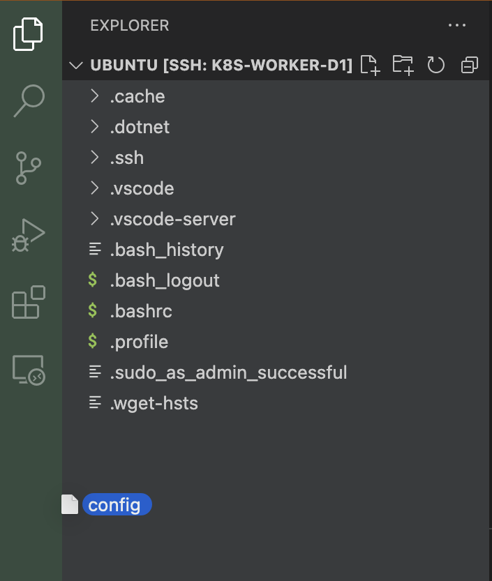

# Adding workers
Using the image, that we have created earlier, we are going to create 2 more compute instances. When they are ready, will be joining to the cluster as workers.

## Create compute instances
1. Go to [compute images](https://cloud.oracle.com/compute/images/)
2. Go to details of the image that you have created
3. Create instance from that image 
4. Give names like `k8s-worker-1` and `k8s-worker-2`
5. Select your SSH key
6. Leave rest default:
    - Optinally you can modify the AD placement. Typically it is a good practice to spread workers across ADs for high availability.
    - E4.Flex 1 core 16GB
    - Public subnet
    - Default disk
7. Repeat once: Create 2 instances in total
8. Add newly created instances into your local SSH Config 

## Watch creation of network pods
Network and its plugins are in forms of containers (pods). You can watch creation of new pods as a new node joins the cluster. It is automatically replicated across all nodes.

Execute the following command on the **master** node:
```shell
watch kubectl get pods -o wide -A --sort-by='.spec.nodeName'
```
You can exit watch later (after completing joining of workers) by pressing `CTRL + C`

## Joining workers
As you have initialized cluster on the master node, it has generated a join command to be executed on the workers. It will look like:
```shell
kubeadm join 10.6.0.56:6443 --token inx5ge.z8lgw44zr3ui9r4t \
        --discovery-token-ca-cert-hash sha256:a8958c7cfa5e57db14e299c98cd466aa6f54821a1a6676d802f474f5e20a0626 
```
> 🚨 Your command will be slightly different. If you copy-paste **my** command above, it will **not** work for you.

1. That command requires root privileges add `sudo` in front of it
2. 💡 This `kubeadm` command might require you to specify `--cri-socket` argument. Please refer to your installed container engine installation document, which you have completed earler.

## Adding kube config to workers
If you need to perform operations on the cluster from the workers, you need to be a k8s authorized user. As we have created the cluster on the master node, kube config file has created for the cluster admin. We can download this.

Hidden files are not visible by default. You can toggle the visilbity via the help of extension **Peek Hidden Files**, which you have remotly installed on the first step. Toggle the visibliltiy as stated in the extension (right click on explorer file list and select *Toggle Excluded Files*). 

Now you see the `.kube` folder. Expand it and right click on the `config` file and **Download** 

After downloading the file to your local computer:
1. Drag & Drop the file to the **worker** node explorer 
2. Execute the following command:
    ```shell
    mkdir -p $HOME/.kube
    mv $HOME/config $HOME/.kube/config
    chmod 600 $HOME/.kube/config
    ```
3. Repeat on both of the workers

You can test via the following command:
```shell
kubectl get nodes
```